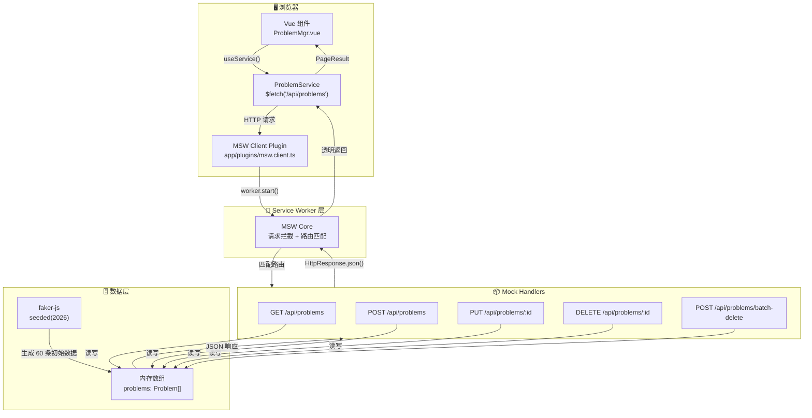
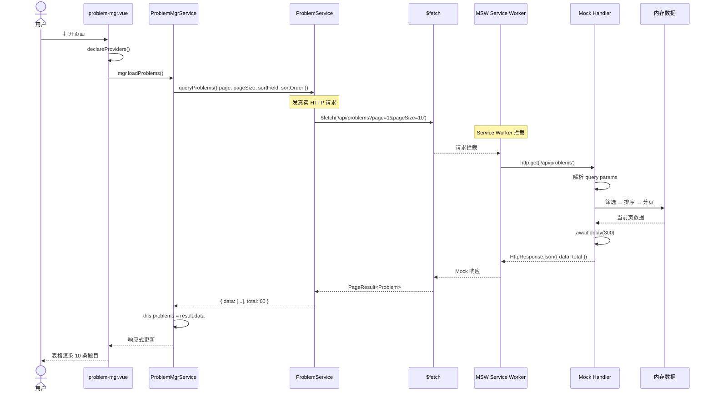
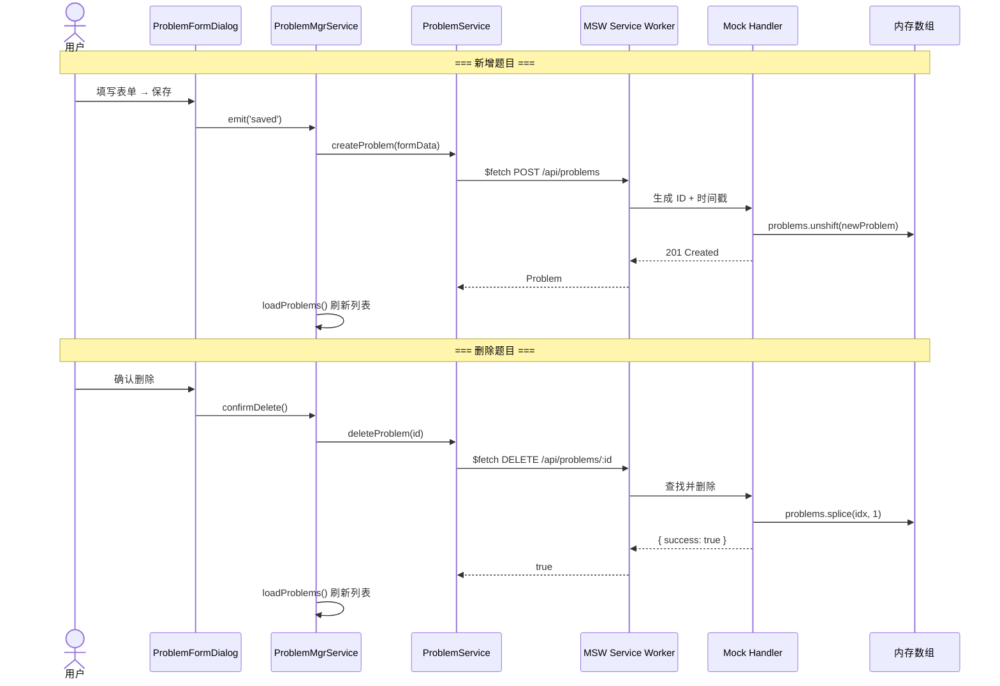

# Mock 方案选型分析

> 基于对当前自研实现和 4 种成熟开源方案的深度调研，提供全面的对比分析和最终推荐。
>
> **关键约束**：本项目通过 SSG 构建后部署到 Cloudflare Pages，需要公网可访问的 Demo 站点。Mock 数据必须在**开发环境和生产环境**同时可用。

---

## 〇、数据流全景

### 整体架构



### 请求生命周期



### 新增/编辑/删除流程



### 关键设计决策

| 决策                    | 说明                                                                                                  |
| ----------------------- | ----------------------------------------------------------------------------------------------------- |
| **Service Worker 拦截** | 在网络层透明拦截，`$fetch` 发起的是真实 HTTP 请求，DevTools Network 面板可见                          |
| **内存数组存储**        | 所有 CRUD 操作修改同一份 `problems[]`，页面刷新后恢复初始数据（符合 Demo 预期）                       |
| **seeded faker-js**     | `faker.seed(2026)` 固定随机种子，每次生成相同数据，方便截图和回归验证                                 |
| **全环境启用**          | 不区分 `import.meta.env.DEV`，SSG 构建后部署到 CF Pages 同样可用                                      |
| **零组件改动**          | `ProblemMgrService` 和所有子组件的接口不变，仅 `ProblemService` 内部从 `@Inject mock` 切换到 `$fetch` |

---

## 一、当前实现分析

### 1.1 架构回顾

```
app/services/mock/
├── mock-utils.ts              # 自定义工具函数 (~235 行)
│   ├── simulateDelay()        # 延迟模拟
│   ├── randomInt/Choice/...   # 随机数据生成
│   ├── paginate()             # 分页
│   ├── applySort()            # 排序
│   ├── applyFilters()         # 筛选（9 种运算符）
│   └── generateId()           # ID 生成
│
├── base-mock.service.ts       # 通用 CRUD 基类 (~140 行)
│   ├── query(params)          # 分页+筛选+排序
│   ├── getById / create / update / delete / batchDelete
│   └── 继承模式：子类只需 initData()
│
layers/sakai/app/services/mock/
└── problem-mock.service.ts    # 业务 Mock (~90 行)
    └── extends BaseMockService<Problem>
```

**集成方式**：Service 层 DI 注入 → 页面 `declareProviders` 注册

**环境适用**：✅ 开发 / ✅ 生产（纯 JS 逻辑，不依赖外部条件）

### 1.2 优点

| 优点            | 说明                                        |
| --------------- | ------------------------------------------- |
| **零外部依赖**  | 不引入任何新 npm 包                         |
| **DI 原生集成** | 完全贴合项目 `@kaokei/di` 模式              |
| **类型安全**    | TypeScript 泛型贯穿全链路                   |
| **筛选能力强**  | 9 种运算符，比多数开源方案更灵活            |
| **轻量级**      | 总计约 465 行原创代码，易于理解和维护       |
| **全环境可用**  | 不在任何环境过滤，dev 和 SSG 生产构建均包含 |

### 1.3 问题

| 问题               | 严重度 | 说明                                                                         |
| ------------------ | ------ | ---------------------------------------------------------------------------- |
| **自研轮子**       | 🔴     | `randomInt`/`randomDate`/`randomChoice` 等是 faker-js 已经完美解决的标准功能 |
| **数据真实性低**   | 🟡     | 手动写死的中文数据数组（题目名、人名），无法生成逼真的地址、电话、邮箱       |
| **无网络层拦截**   | 🟡     | 不是真正的 HTTP mock；Service 直接调用 Mock 类，将来切真实 API 需改代码      |
| **扩展性弱**       | 🟡     | 新增业务领域需手工写 generateXxxData()，数据生成模式重复                     |
| **无请求日志**     | 🟢     | 没有网络请求级别的日志、DevTools 集成                                        |
| **无错误场景模拟** | 🟢     | 不便于测试 500/超时/网络断开等边缘情况                                       |
| **数据不可复现**   | 🟢     | `Math.random()` 每次结果不同，不利于调试和截图                               |

---

## 二、候选方案

### 方案 A：MSW（Mock Service Worker）

**定位**：行业标准的网络层 API Mock 库

| 维度                | 详情                                                                    |
| ------------------- | ----------------------------------------------------------------------- |
| **原理**            | Service Worker 在浏览器网络层拦截 `fetch`/`XMLHttpRequest`              |
| **成熟度**          | ⭐⭐⭐⭐⭐ GitHub 16k+ stars，React/Vue/Angular 通用                    |
| **SPA 兼容**        | ✅ 完美（纯客户端拦截，与 ssr:false 天然兼容）                          |
| **Nuxt 集成**       | 通过 Nuxt plugin（`plugins/msw.client.ts`）初始化                       |
| **生产可用**        | ✅ 去掉 `import.meta.env.DEV` 条件即可，Service Worker 可在任意环境注册 |
| **依赖**            | `msw`（~15KB browser bundle）                                           |
| **Cloudflare 兼容** | ⚠️ 需验证 CF Pages 的 Service Worker 加载策略                           |

#### 集成示例

```typescript
// mocks/handlers/problems.ts
import { HttpResponse, http } from 'msw';

// plugins/msw.client.ts
// 注意：不检查 import.meta.env.DEV！所有环境都启用
export default defineNuxtPlugin(async () => {
  const { worker } = await import('../mocks/browser');
  await worker.start({ onUnhandledRequest: 'warn' });
});

let problems = generateMockProblems(60); // 用 faker-js 生成

export const problemHandlers = [
  http.get('/api/problems', ({ request }) => {
    const url = new URL(request.url);
    const page = Number(url.searchParams.get('page') || 1);
    const pageSize = Number(url.searchParams.get('pageSize') || 10);
    // 筛选、排序、分页...
    return HttpResponse.json({ data: paged, total: problems.length });
  }),

  http.post('/api/problems', async ({ request }) => {
    const body = await request.json();
    const created = { id: generateId(), ...body };
    problems.push(created);
    return HttpResponse.json(created, { status: 201 });
  }),

  // 模拟错误
  http.get('/api/problems/error', () =>
    HttpResponse.json({ message: '服务器错误' }, { status: 500 }),
  ),
];
```

#### Service 层变化

```typescript
// 之前：直接调用 Mock 类
@Injectable()
export class ProblemService {
  @Inject(ProblemMockService) private mock!: ProblemMockService
  async queryProblems(params) { return this.mock.query(params) }
}

// 之后：发真实 HTTP 请求，MSW 自动拦截
@Injectable()
export class ProblemService {
  async queryProblems(params) {
    return $fetch('/api/problems', { query: params })
  }
}
```

### 方案 B：MSW + faker-js（推荐组合）

**定位**：MSW 负责拦截，faker-js 负责生成数据

| 维度              | 详情                                                                |
| ----------------- | ------------------------------------------------------------------- |
| **faker-js 功能** | 24 个数据模块：Person/Location/Company/Finance/Commerce/...         |
| **中文 locale**   | ✅ `fakerZH_CN` 完整支持：中文姓名、公司名、城市（38+）、菜品、颜色 |
| **版本**          | v10.4.0（2026.03）                                                  |
| **打包大小**      | 全量 438KB / 189KB gzip；按需导入（`fakerZH_CN`）更小               |
| **许可证**        | MIT                                                                 |
| **生产环境**      | ✅ 正常导入即可，无环境限制                                         |

#### faker-js 中文数据生成示例

```typescript
import { fakerZH_CN as faker } from '@faker-js/faker';

faker.person.fullName(); // '伟宸'、'子涵'、'思淼'
faker.location.city(); // '深圳市'、'广州市'
faker.company.name(); // '广东省伟祺网络科技集团有限公司'
faker.phone.number(); // '13912345678'
faker.date.past({ years: 1 }); // 过去一年内随机日期
faker.string.uuid(); // UUID
faker.helpers.arrayElement(['A', 'B', 'C']); // 随机选一
faker.number.int({ min: 100, max: 50000 }); // 范围整数
```

### 方案 C：MirageJS

**定位**：ORM 风格的客户端 Mock Server

| 维度         | 详情                                                                    |
| ------------ | ----------------------------------------------------------------------- |
| **原理**     | monkey-patch `XMLHttpRequest`/`fetch`（Pretender.js）                   |
| **核心概念** | Model（数据模型）/ Factory（工厂）/ Route（路由）/ Serializer（序列化） |
| **SPA 兼容** | ✅ 通过 Nuxt plugin 初始化                                              |
| **生产可用** | ✅ 不依赖环境变量                                                       |
| **特点**     | 内置 ORM 关系（hasMany/belongsTo），自动管理关联数据                    |
| **缺点**     | 最近发布频率低，社区相对不活跃                                          |

### 方案 D：json-server

**定位**：零代码的 REST API Mock 服务器

| 维度         | 详情                                                       |
| ------------ | ---------------------------------------------------------- |
| **原理**     | 独立 Node.js 进程，读取 JSON 文件提供完整 REST API         |
| **生产可用** | ❌ 需要独立服务器进程，不适合纯静态 SSG 部署               |
| **优点**     | 零代码，适合快速原型                                       |
| **缺点**     | 需要独立进程；无逻辑能力；不适合 Cloudflare Pages 静态部署 |

### 方案 E：Nuxt server/api（Nitro）

**定位**：Nuxt 内置的 API 路由

| 维度         | 详情                                             |
| ------------ | ------------------------------------------------ |
| **生产可用** | ❌ `ssr: false` 时 server/api 不在生产构建中输出 |
| **适用场景** | Nuxt SSR 项目                                    |

---

## 三、多维度对比（含生产部署视角）

| 维度                 | 当前自研        | MSW             | MSW+faker         | MirageJS       |
| -------------------- | --------------- | --------------- | ----------------- | -------------- |
| **外部依赖**         | 0               | 1 (`msw`)       | 2 (`msw`+`faker`) | 1 (`miragejs`) |
| **拦截层级**         | Service 层      | 网络层          | 网络层            | 应用层         |
| **生产可用**         | ✅              | ✅              | ✅                | ✅             |
| **数据真实性**       | ⭐⭐            | ⭐⭐            | ⭐⭐⭐⭐⭐        | ⭐⭐⭐         |
| **中文数据**         | 手动写死        | 手动写死        | ✅ 内置 38+ 城市  | ❌             |
| **DevTools 集成**    | ❌              | ✅ Network Tab  | ✅ Network Tab    | ❌             |
| **错误场景模拟**     | ❌              | ✅ 3行代码      | ✅ 3行代码        | ✅ 支持        |
| **请求日志**         | ❌              | ✅              | ✅                | ✅             |
| **代码量/新业务**    | ~90行           | ~50行           | ~40行             | ~50行          |
| **切真实 API 改动**  | 改 Service 内部 | 删除 MSW plugin | 删除 MSW plugin   | 删除 plugin    |
| **测试复用**         | ❌              | ✅ 同 handler   | ✅ 同 handler     | ✅ 同 handler  |
| **打包大小（生产）** | 0               | ~15KB           | ~15KB+200KB\*     | ~25KB          |
| **TypeScript**       | ✅ 泛型         | ✅ 泛型         | ✅ 泛型           | ⚠️ 部分        |

> \*faker-js 中文 locale 按需导入实际约 200KB gzipped；对于 Demo 模版站点可接受

---

## 四、推荐方案（修订）

### 🏆 首选：MSW + faker-js（方案 B）

**核心理由**（修订后，加入生产部署视角）：

| #   | 理由                                                                                     |
| --- | ---------------------------------------------------------------------------------------- |
| 1   | **网络层拦截**——Service 层发真实 HTTP 请求，MSW 透明拦截。将来切真实 API **零代码改动**  |
| 2   | **faker-js 中文数据**——38+ 中国城市、完整中文姓名/公司名/菜品/颜色，数据质量远超手写     |
| 3   | **DevTools 可见**——请求出现在浏览器 Network Tab，可检查请求/响应，调试体验等同真实 API   |
| 4   | **错误场景覆盖**——3 行代码模拟 404/500/超时/网络断开，开发和测试都能用                   |
| 5   | **测试复用**——同一套 handlers 可用于 Vitest/Playwright 测试                              |
| 6   | **全环境可用**——不区分 dev/prod，SSG 构建后部署到 CF Pages 仍正常工作                    |
| 7   | **生产打包可接受**——MSW (~15KB) + faker-js (~200KB gzipped) 对于 Demo 模版站点完全可接受 |

### ⚠️ 生产部署考量

| 项目                   | 说明                                                                              |
| ---------------------- | --------------------------------------------------------------------------------- |
| **MSW Service Worker** | `mockServiceWorker.js` 需放在 `public/` 目录，SSG 构建时一并输出                  |
| **faker-js 打包大小**  | ~200KB gzipped 对于 Demo 模版可接受；clone 后切真实 API 时可移除依赖              |
| **Cloudflare Pages**   | MSW 的 Service Worker 与 CF Worker 是不同层级（浏览器端 vs 边缘），不冲突         |
| **seeded randomness**  | 建议使用 `faker.seed(123)` 固定随机种子，保证每次页面加载数据一致，便于 Demo 展示 |

### 🥈 次选：保持当前自研 + faker-js

如果不希望引入 MSW 的 Service Worker 复杂度，可仅引入 faker-js 替换 `mock-utils.ts` 中的数据生成部分：

```
当前自研架构（保留）
    +
faker-js（替换 randomInt/randomDate/randomChoice）
```

**优点**：改动最小，功能不变
**缺点**：仍然没有网络层拦截和 DevTools 集成

---

## 五、实施细节预览

### 5.1 目录结构

```
├── public/
│   └── mockServiceWorker.js          # npx msw init 自动生成（MSW Service Worker 脚本，部署必需品）
├── mocks/
│   ├── browser.ts                    # MSW Worker 入口，注册所有 handlers
│   ├── handlers/
│   │   ├── index.ts                  # handlers 聚合出口，新增 handler 模块需在此注册
│   │   └── problems.ts               # 题目 CRUD handlers（相当于后端 Controller + Service 层）
│   └── data/
│       └── problems.ts               # 数据模型定义（接口类型）+ faker-js 假数据生成器（seed 固定）
├── app/
│   └── plugins/
│       └── msw.client.ts             # Nuxt 插件，浏览器端启动 MSW（.client 后缀 = 仅客户端执行）
```

#### 各文件职责详解

| 文件                          | 类比真实后端                | 具体职责                                                                                                             |
| ----------------------------- | --------------------------- | -------------------------------------------------------------------------------------------------------------------- |
| `mocks/browser.ts`            | 应用启动器                  | 创建 MSW Worker，将 handlers 数组注册到拦截器。**一般无需修改。**                                                    |
| `mocks/handlers/index.ts`     | 路由注册中心                | 聚合所有 handler 模块为一个数组导出。**新增业务模块时在此追加。**                                                    |
| `mocks/handlers/problems.ts`  | **Controller + Service 层** | 定义 API 路由（GET/POST/PUT/DELETE）+ 完整业务逻辑（分页、排序、CRUD、筛选）。**自定义后端逻辑的核心文件。**         |
| `mocks/data/problems.ts`      | **数据库表结构 + 种子数据** | 定义 `Problem` 接口（相当于 DDL）+ 用 faker 生成 60 条假数据（相当于 INSERT seed）。**新增业务数据模型时在此仿写。** |
| `app/plugins/msw.client.ts`   | 中间件启动器                | `.client` 后缀确保仅在浏览器端执行（SSR 跳过）。Nuxt 启动时自动 `worker.start()`。**无需修改。**                     |
| `public/mockServiceWorker.js` | Service Worker 运行时       | MSW 核心拦截脚本，由 `npx msw init` 生成，**不手写、不修改。**                                                       |

### 5.2 Problem Service 重构对比

```typescript
// ===== 当前实现 =====
@Injectable()
export class ProblemService {
  @Inject(ProblemMockService) private mock!: ProblemMockService;

  async queryProblems(params) {
    return this.mock.query(params);       // 直接调用 Mock 类
  }
}

// ===== MSW 方案 =====
@Injectable()
export class ProblemService {
  async queryProblems(params: ProblemQueryParams) {
    return $fetch('/api/problems', { query: params });  // 真实 HTTP 请求
    // ↑ MSW 在所有环境自动拦截，返回 mock 数据
    // ↑ 将来切真实 API：删除 msw plugin，指向真实 baseURL
  }
}
```

### 5.3 faker-js 数据生成（seeded）

```typescript
// mocks/data/problems.ts
import { fakerZH_CN as faker } from '@faker-js/faker';

faker.seed(2026); // 固定种子，每次生成相同数据

export function generateProblems(count = 60): Problem[] {
  return Array.from({ length: count }, (_, i) => ({
    id: faker.string.uuid(),
    problemNumber: `OJ-${1001 + i}`,
    title: `算法题${i + 1}: ${faker.helpers.arrayElement(titles)}`,
    owner: faker.person.fullName(), // '伟宸'
    difficulty: faker.helpers.arrayElement(['Easy', 'Medium', 'Hard']),
    tags: faker.helpers.arrayElements(allTags, { min: 1, max: 4 }),
    acceptanceRate: faker.number.float({
      min: 20,
      max: 100,
      fractionDigits: 1,
    }),
    submissions: faker.number.int({ min: 100, max: 50000 }),
    timeLimit: faker.helpers.arrayElement([500, 1000, 2000]),
    memoryLimit: faker.helpers.arrayElement([64, 128, 256, 512]),
    createTime: faker.date.past({ years: 1 }),
    lastModifiedTime: faker.date.recent({ days: 30 }),
    accessLevel: faker.helpers.arrayElement(['Public', 'Private', 'Shared']),
    description: faker.lorem.paragraph(),
  }));
}
```

### 5.4 自定义后端逻辑操作指南

#### 修改现有接口逻辑

直接编辑 **`mocks/handlers/problems.ts`**。例如修改列表查询的返回格式：

```typescript
http.get('/api/problems', async ({ request }) => {
  // ... 筛选、排序、分页逻辑
  // 修改返回格式：增加 page、pageSize 字段
  return HttpResponse.json({ data, total, page, pageSize });
});
```

#### 新增 API 接口（三步走）

**第一步**：在 `mocks/data/` 下新建数据模型文件（可选，也可以直接在 handler 中造数据）

```typescript
// mocks/data/users.ts
import { fakerZH_CN as faker } from '@faker-js/faker';

export interface User {
  id: string;
  name: string;
  role: 'admin' | 'user';
  email: string;
}

export function generateUsers(count = 20): User[] {
  return Array.from({ length: count }, () => ({
    id: faker.string.uuid(),
    name: faker.person.fullName(),
    role: faker.helpers.arrayElement(['admin', 'user']),
    email: faker.internet.email(),
  }));
}
```

**第二步**：在 `mocks/handlers/` 下新建 handler 文件

```typescript
// mocks/handlers/users.ts
import { HttpResponse, delay, http } from 'msw';
import { generateUsers } from '../data/users';

let users = generateUsers(20);

export const userHandlers = [
  http.get('/api/users', async () => {
    await delay(200);
    return HttpResponse.json(users);
  }),

  http.post('/api/users', async ({ request }) => {
    const body = await request.json();
    const created = { id: crypto.randomUUID(), ...body };
    users.unshift(created);
    await delay(300);
    return HttpResponse.json(created, { status: 201 });
  }),
];
```

**第三步**：在 `mocks/handlers/index.ts` 中注册

```typescript
import { problemHandlers } from './problems';
import { userHandlers } from './users';

// ← 新增 import

export const handlers = [
  ...problemHandlers,
  ...userHandlers, // ← 追加到数组
];
```

注册完成后无需重启，Vite HMR 会自动生效。

### 5.5 mocks/data 文件夹深度解析

`mocks/data/` 扮演的是 **"内存数据库"** 的角色，它提供三样东西：

#### ① 数据结构定义（相当于数据库的 DDL）

```typescript
export interface Problem {
  id: string;
  problemNumber: string; // 题目编号
  title: string; // 标题
  difficulty: 'Easy' | 'Medium' | 'Hard';
  tags: string[]; // 标签
  acceptanceRate: number; // 通过率
  submissions: number; // 提交数
  createTime: string; // 创建时间
  // ... 更多字段
}
```

这个接口同时被 **handlers（后端）** 和 **前端 Vue 组件** 共享，保证数据契约一致。

#### ② 业务常量（相当于字典表/枚举）

```typescript
const ALL_TAGS = ['数组', '字符串', '哈希表', '动态规划', '贪心', ...];  // 20 个算法标签
const TITLE_PREFIXES = ['两数之和', '最长子串', '中位数查找', ...];      // 24 个题目标题前缀
const DIFFICULTIES = ['Easy', 'Medium', 'Hard'];                        // 难度枚举
```

这些常量提供逼真的中文数据素材，handlers 中获取选项列表（如标签下拉框、难度筛选）时也依赖它们。

#### ③ 假数据生成器（相当于数据库的 INSERT seed）

```typescript
faker.seed(2026); // 固定随机种子：每次生成一模一样的数据，方便截图和回归验证

export function generateProblems(count = 60): Problem[] {
  return Array.from({ length: count }, (_, i) => ({
    id: faker.string.uuid(),
    title: `${faker.helpers.arrayElement(TITLE_PREFIXES)} ${faker.number.int({ min: 1, max: 999 })}`,
    owner: faker.person.fullName(), // 生成中文姓名
    tags: faker.helpers.arrayElements(ALL_TAGS, { min: 1, max: 4 }),
    // ... 每个字段都由 faker 随机生成
  }));
}
```

在 handlers 中被调用：

```typescript
// mocks/handlers/problems.ts 第 5 行
let problems = generateProblems(60); // ← 相当于 "SELECT * FROM problems" 的结果加载到内存
```

#### 数据流全景

```
mocks/data/problems.ts
    ├── Problem 接口           ← 表结构（DDL）
    ├── ALL_TAGS 等常量        ← 字典/枚举
    └── generateProblems()     ← 种子数据生成器
              ↓ 被 import
mocks/handlers/problems.ts
    let problems = generateProblems(60)   ← "数据库加载到内存"
    http.get/post/put/delete 操作该数组   ← "SQL CRUD 操作"
              ↓ 被 import
mocks/handlers/index.ts
    export handlers = [...problemHandlers]  ← 注册路由
              ↓ 被 import
mocks/browser.ts
    setupWorker(...handlers)               ← 启动拦截器
```

**关键理解**：当你说 "相当于后端 API"，真正等价于后端三层架构的映射是：

| 真实后端三层           | mocks 对应                                                                |
| ---------------------- | ------------------------------------------------------------------------- |
| Controller（路由分发） | `handlers/problems.ts` 中的 `http.get/post/put/delete`                    |
| Service（业务逻辑）    | `handlers/problems.ts` 中各 handler 的函数体（分页/筛选/CRUD）            |
| DAO / Database         | `data/problems.ts` 的 `generateProblems()` + handlers 中的 `let problems` |

### 5.6 MSW 内部架构深度解析

#### 为什么 `mocks/` 放在项目根目录而非 `app/` 下？

| 原因                                | 说明                                                                                                               |
| ----------------------------------- | ------------------------------------------------------------------------------------------------------------------ |
| **动态 import，不进 Nuxt 打包主图** | `await import('../../mocks/browser')` 实现代码分割，`mocks/` 作为独立 async chunk，Vite 编译但不打包进主 bundle    |
| **非应用代码**                      | `mocks/` 是框架无关的纯 MSW + faker 代码，不依赖 Vue / Nuxt / DI 系统，可原封不动搬到 React 项目                   |
| **避免 Nuxt 自动导入干扰**          | 放在 `app/` 下可能触发 Nuxt 的 composable / component 自动导入扫描，而 `mocks/` 里的 `http`、`msw` API 与 Vue 无关 |
| **MSW 官方惯例**                    | 几乎所有 MSW 项目都把 `mocks/` 放在根目录                                                                          |

#### `mocks/browser.ts` 与 `public/mockServiceWorker.js` 的区别

这两个文件**不是同一个东西**，运行在不同线程：

```
┌─────────────────── 浏览器主线程 ──────────────────────┐
│                                                         │
│  mocks/browser.ts（编译后）                              │
│  ┌─────────────────────────────────────┐               │
│  │ setupWorker(...handlers)             │  ← 注册业务规则│
│  │ worker.start()                       │               │
│  │  ├─ 注册 Service Worker               │               │
│  │  └─ 创建 MessageChannel 双向通道       │               │
│  └──────────────┬──────────────────────┘               │
│                 │  postMessage + MessageChannel          │
│                 ▼                                        │
├─────────────────── Service Worker 线程 ────────────────┤
│                                                         │
│  public/mockServiceWorker.js                            │
│  ┌─────────────────────────────────────┐               │
│  │ self.addEventListener('fetch', e => {│  ← 真正拦截请求 │
│  │   // 拦截 → 转发到主线程 → 等结果      │               │
│  │   // → 返回给页面                     │               │
│  │ })                                   │               │
│  └─────────────────────────────────────┘               │
└─────────────────────────────────────────────────────────┘
```

| 维度                 | `mocks/browser.ts`                    | `public/mockServiceWorker.js`        |
| -------------------- | ------------------------------------- | ------------------------------------ |
| **运行位置**         | 主线程                                | Service Worker 线程                  |
| **是否编译**         | ✅ Vite 编译（TypeScript → JS chunk） | ❌ 原样拷贝，不编译                  |
| **加载方式**         | `await import('../../mocks/browser')` | `navigator.serviceWorker.register()` |
| **可 import npm 包** | ✅（msw、faker 等）                   | ❌（仅原生浏览器 API，无打包）       |
| **内容**             | 业务规则（handler 函数）              | 拦截引擎（fetch 事件监听 + 转发）    |
| **修改频率**         | 频繁（开发中改业务逻辑）              | 从不（由 `npx msw init` 生成）       |

#### MessageChannel 通信机制：handler 如何被 Service Worker 执行？

`setupWorker(...handlers)` **并没有把 handler 函数发给 Service Worker**——`postMessage` 只能传 JSON，不能传函数。MSW 的实际做法是**反向转发**：

```
$fetch('/api/problems')
        │
        ▼
  SW 拦截 fetch 事件（mockServiceWorker.js）
        │
        │  通过 MessageChannel 把原始请求发回主线程
        ▼
  主线程 MSW 客户端（setupWorker 内部代码）
        │
        │  遍历 handlers 数组，匹配到 http.get('/api/problems', ...)
        │  调用你写的 resolver(request)，得到 Response
        │
        │  通过 MessageChannel 把 Response 发回 SW
        ▼
  SW: event.respondWith(response)
        │
        ▼
  $fetch 拿到 mock 数据，渲染到页面
```

核心思路：**SW 只做转发代理，不做任何业务处理。** 真正的路由匹配、数据处理、状态修改全部在主线程完成。

#### 为什么不把 handler 直接打包进 `mockServiceWorker.js`？

| 方案                    | 效果                             | 代价   |
| ----------------------- | -------------------------------- | ------ |
| **打包进 SW**           | 省一次 postMessage 往返（< 1ms） | 见下方 |
| **MessageChannel 转发** | 多 1 次线程通信                  | 零代价 |

打包进 SW 的三个致命问题：

**① HMR 不兼容（最大痛点）**

SW 文件一旦注册，浏览器对它做**字节级比对**。你改一行 handler 代码 → SW 文件内容变了 → 浏览器触发 install → wait → activate 完整生命周期 → **必须关闭所有标签页重新打开**才能激活新 SW。

MSW 的 MessageChannel 方案：Vite HMR 推送 → 主线程原地替换 handlers 数组 → SW 不受影响 → 新逻辑**即时生效，零刷新**。

```
打包进 SW 方案：改代码 → 重编译 → SW 进入 waiting →
               手动 skipWaiting 或重启标签页 → 生效（10-30 秒）

MessageChannel： 改代码 → HMR 推送 → 即时生效（< 1 秒）
```

**② 闭包状态无法序列化**

```typescript
let problems = generateProblems(60); // 主线程内存

http.put('/api/problems/:id', async ({ params, request }) => {
  problems[idx] = { ...problems[idx], ...body }; // 修改内存
});
```

如果 handler 在 SW 里执行，`problems` 数组必须在 SW 中。SW 有自己的独立内存空间，**页面刷新后主线程重置，SW 不重置**——数据会持久残留，不符合 Demo "刷新即恢复"的预期。

**③ SW 内无法 import npm 包**

`public/` 目录文件原样拷贝，不走 Vite 编译。要 `import { HttpResponse } from 'msw'` 或 `import { fakerZH_CN } from '@faker-js/faker'`，需要为 SW 单独维护一套构建流程（独立 entry、tsconfig、rollup/webpack 配置）。

#### 总结

MSW 的架构本质上是一个**基于 MessageChannel 的请求代理**：SW 拦截 → 转发主线程执行 handler → 结果回传 SW → 返回给页面。这种设计牺牲了理论上的一次线程通信开销，换来了**开发体验（HMR）、状态一致性（共享主线程内存）、零配置（无需 SW 独立构建）**。

---

## 六、与生产环境的关系

```
                    ┌─ 开发环境 (pnpm dev) ──┐    ┌─ SSG 生产部署 (CF Pages) ──┐
                    │                         │    │                             │
$fetch('/api/xxx') ─┼─→ MSW Service Worker ──┼────┼─→ MSW Service Worker ───────┤
                    │   (拦截 + mock 响应)     │    │   (拦截 + mock 响应)         │
                    │                         │    │                             │
                    └─────────────────────────┘    └─────────────────────────────┘

将来有真实后端时：
                    ┌─ 生产环境 ──────────────┐
                    │                         │
$fetch('/api/xxx') ─┼─→ 真实 API 服务器 ──────┤
                    │   (删除 msw plugin)      │
                    │                         │
                    └─────────────────────────┘
```

---

## 七、为什么不选其他方案

| 方案                   | 不推荐原因                                                            |
| ---------------------- | --------------------------------------------------------------------- |
| **当前自研（不改）**   | 重复造轮子；数据质量低；无 DevTools 集成；无网络层拦截                |
| **当前自研 + faker**   | 可行但仍有缺陷：无网络层拦截、无 DevTools 集成                        |
| **纯 MSW（无 faker）** | 数据生成仍需手写（但已比当前自研大幅改善）                            |
| **MirageJS**           | monkey-patch 方式不如 Service Worker 优雅；社区活跃度下降；无中文数据 |
| **json-server**        | 需要独立进程，不适合 Cloudflare Pages 纯静态部署                      |
| **Nuxt server/api**    | `ssr: false` 时生产构建不包含                                         |

---

_本文档由 Sisyphus 生成于 2026-05-13。基于 MSW v2、faker-js v10、miragejs 官方文档及 GitHub 实际项目调研。已针对 SSG + Cloudflare Pages 生产部署场景修订。_
